Rezumat structura codului

Deșii au trecut 20 de ani de la originalul OpenGL, foarte multe din funcțiile originale au rămas deoarece erau foarte eficiente. În principal, se declară un model 3d, se alege culoarea și poziția acestuia, se crează un spațiu în memoria procesorului grafic si în final, ajutat de sistemul de operare, modifică pixelii de pe ecran în funcție de parametrii setați mai devreme.

În această ordine vor fi create diferitele variabile:

1.  Se va inițializa o variabila care reține clasa MTKDevice pentru a ține dispozitivul. Și langa el vom zidi un CommandQueue() pentru a trimite absolut totul într-un singur pachet mai târziu. Practic asta este o problema de logistică și este mai eficient sa trimitem un singur curier la procesorul video decât mai mulți cu diferite detalii fiecare.
2.  Vom crea un model 3D “primitiv” de tip MTKMesh dintr-un MDLMesh care va fi actorul principal.
3.  Formăm un MTLRenderPipelineDescriptor() pentru a specifica ce fel de shadere (explicații la capitolul Shadere) o să fie folosite și cât spațiu o să consume în memoria procesorului grafic pentru a reda modelul creat mai sus.
4.  Comprim obiectul de la punctul 3 într-un MTLRenderPipelineState(), versiunea compresată de la MTLRenderPipelineDestriptor(), pentru a consuma mai puțin spațiu în memorie.
5.  În funcția draw(în view: MTKView) se începe împachetarea amănuntelor alese mai sus într-un CommandBuffer(), versiunea compresată de la CommandQueue().
6.  O ultimă clasă o sa fie formata care specifică poziția și culoarea modelului 3d.
7.  În final, totul este pus în CommandBuffer() (creat de CommandQueue() de la pasul 1), se aloca memoria în placa video, se așteaptă câteva milisecunde și abracadingo se poate observa modelul 3d care se misca cu o anumită culoare pe ecran.

**Shaderele**

În general, programarea se face pe un limbaj de programare precum C++, C\#, **Swift**, Java, etc, dar pentru placa video este nevoie de alte limbaje de programare mai simple pentru a putea fi extrem de rapide. Procesorul grafic fiind un cip dedicat și nu general, nu are la fel multe funcții ca și un procesor general. Aceste fișiere se numesc shadere, compilate pe CPU și folosite de GPU.

Limbajul shaderelor de obicei este specific unei librarii grafice ca **Metal** (Metal Shading Language). Din cauza diferitelor deosebiri între limbajul de shadere de la **Metal** sau de la DirectX, se folosesc limbaje de shadere mai comune și mai flexibile precum HLSL (High Level Shading Language).

În trecut, singurul scop al acestor procesoare grafice era în console, calculatoare și arcade pentru a reda jocuri video. Termenul de Shader a început sa fie folosit deoarece erau folosite pentru a calcula zonele umbrite si luminate în jocurile video. “Shade” insemnand “umbra” și “shader” motamo este “cel ce umbrește”.

Astăzi shaderele sunt folosite și pentru calcule generale pe plăcile video. De la aplicatile de montaj făcute de Disney, pana la redarea filmelor de calitate iMax din confortul casei oamenilor fără ca aceștia să simtă complexitatea din spatele cortinei.

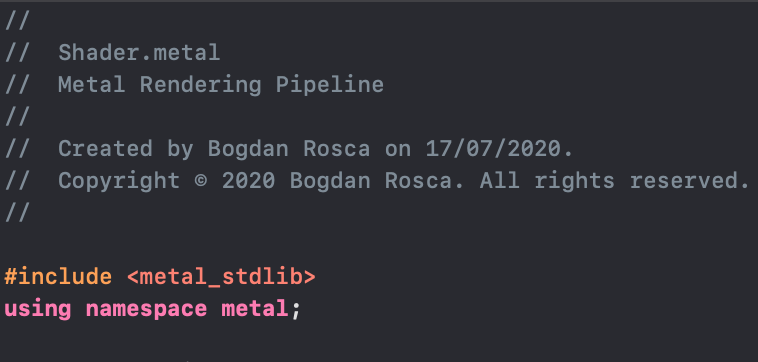

Shaderele sunt împărțite în doua funcții importante: vertex si fragment/pixel.

Vertex primește la apelari vârfurile unui model 2d/3d și face câte un calcul pentru fiecare vârf. “Vertex” însemnând “vârf”.

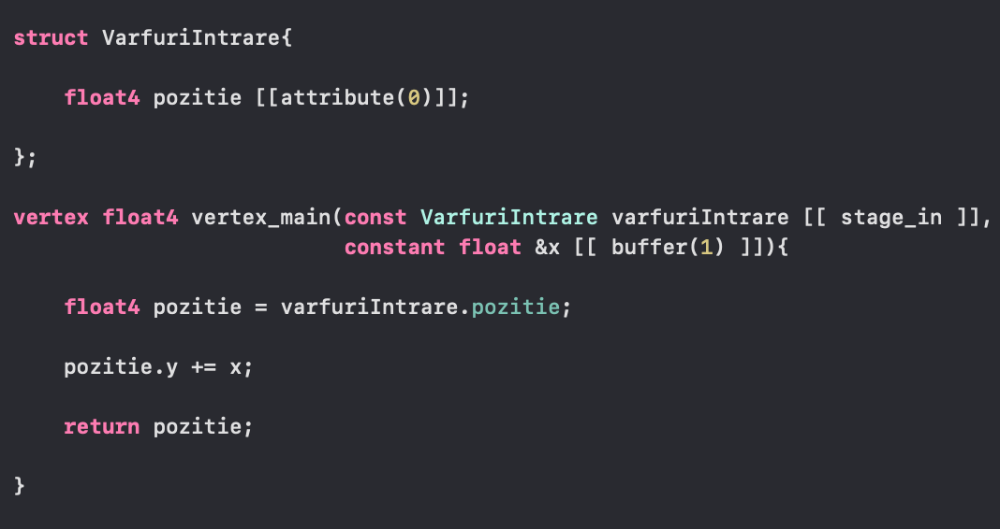

Fragment/pixel nu are nevoie de nicio variabilă și returnează o culoare pentru fiecare pixel de pe ecran. Se mai numește și fragment pentru că uneori returnează o culoare pentru o grupare de pixeli de pe ecran în același timp, astfel diminuând timpul de calcul necesar.

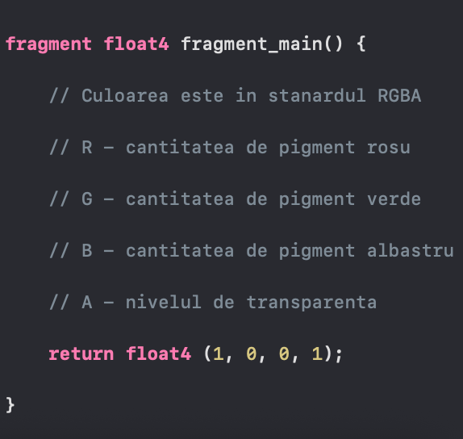

**Modul în care codul este inițializat în Swift față de C++**

În C++, toate programele încep din int main(), dar în **Swift** se schimba modalitatea de gandire. Apple, cand a făcut limbajul de programare a pus problema altfel. În loc să facă o singura operatie principala, au decis ca în funcție de utilitatea programului, sa existe diferite moduri de a începe programul.

Astfel, de dragul simplității, au creat un standard între toate dispozitivele lor pentru a rula un program **swift**. Fiecare aplicație care nu e o consolă, începe cu un Window Controller. De obicei, aici nu se întâmplă foarte multe pe care le putem controla. În cazul nostru, este mai importantă partea a doua care se numește ViewController care este hârtia suprapusă pe care noi o vom desena și colora.

Este creată o clasă care este moștenită din NSViewController. După crearea ferestrei, macos apelează funcția viewDidLoad(), de aceea o și extindem cu cod în plus. De aici, putem spune că am creat un int main().

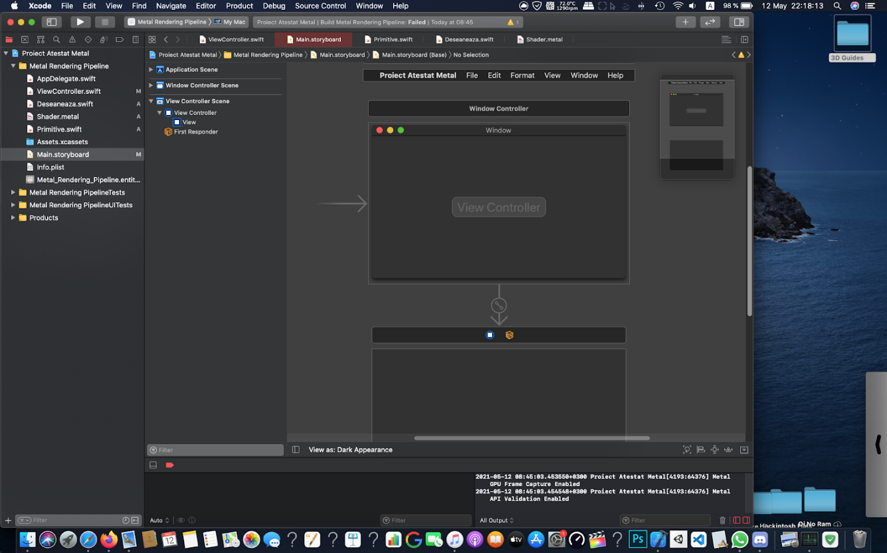

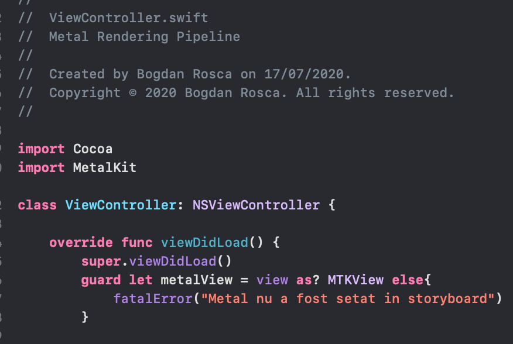

O problema, nu tocmai aparentă la prima vedere apare: Cum pot face ca aplicația sa fie dinamica si sa proceseze pe fundal alte lucruri după ce a fost inițializată?

În OpenGL, Direct3D și Vulkan, toate operațiile se fac tot în int main(). Aceste operații, spre deosebire de **Metal** trebuie sa recalculeze absolut totul de fiecare data cand se schimba imaginea. Direct3D, de exemplu, creaza echivalentul lui Window Controller de Windows și după aceea totul se face într-un while(true). În realitate, nu e doar un while(true), deobicei este ceva mai apropiata de “cat timp aplicația este deschisă și răspunde la comenzi și driverele funcționează”.

În **Metal**, se creaza o alta clasa care este mostenita din MTKViewDelegate. “Delegate”, tradus motamo înseamnă “a delega”. În conformitate cu denumirea, această clasă preia ștafeta de la ViewController.

Noua clasă pe care o numim “Deseneaza” aduce și funcții noi precum draw() și mtkView().

Modul în care fiecare aplicație apelează funcția este asemanator cu o camera video. O data la cateva milisecunde senzorul capturează lumina și procesorul ajusteaza culorile și o adaugă la video. Un film poate sa fie filmat la 25, 30 sau 60, sau orice număr mai mare, mai mic sau între, cadre pe secundă. Spre deosebire de camere, un program mai intai face toata procesoare după aceea reda pe ecran. Pe aplicația de la facebook, mai intai verifica ultimele postari, noile mesaje, etc și după aceea apar pe ecran toate informațiile și notificările.

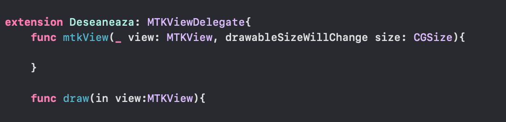

Asta face și funcția draw(). În fiecare librarie grafica exista o astfel de funcție și peste granița este foarte cunoscută ca și “draw call”. Aici se verifica lucrurile menționate mai sus legate de facebook. Sau în cazul exercițiului, va mișca figura ulterior cubul desenat sus-jos folosind sinus.

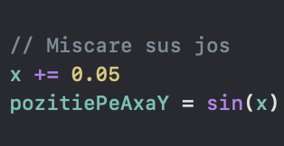

Dar mai întâi trebuie declarate x și pozitiePeAxaY ca și float în clasa Desenează.

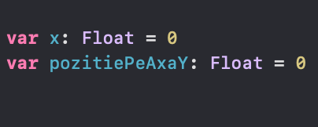

A doua funcție, deși mai puțin interesantă, are o importanță la fel de mare. Find apelată la schimbarea ferestrei aplicației, nu este apelată foarte des.

**Diferente majore intre Metal si OpenGL**

Cu toate ca am menționat mai sus alte librării foarte capabile fata de OpenGL, acesta ramane standardul “auriu”.

Find scris în C++, inițializarea se face în int main() și operațiile per cadru se fac într-un while(true).

La începutul fiecărui cadru nou, când ecranul este reîmprospătat, fiecare lucru care este desenat trebuie sa i se atribuie ce shadere sa folosească, poziția și culoarea lui. În **Metal**, pentru a salva niște timp de procesare, unele atribuiri se seteaza doar o data și raman salvate în memorie pe tot parcursul programului.

De dragul organizării, o sa apara o clasa nouă numita “Desenează” care reiese din NSObject. Deobicei nu ar fi nevoie, dar doresc o consistentă în folosirea ustensilelor deja gandite pentru eficienta si standardizare de-a lungul altor programe și fișiere.

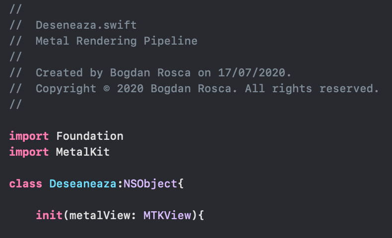

Nu trebuie uitată formarea acestei clase în init() de la ViewController. Cele doua puncte de la crearea variabilei reprezinta tipul de memorie alocat. Semnul de întrebare “forțează” aceasta comanda.

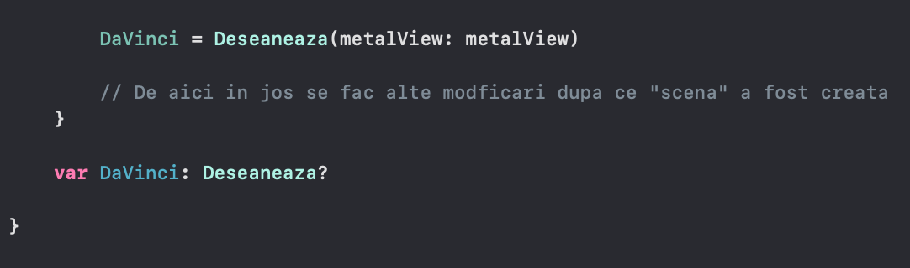

**Clasa Desenează, luată în detaliu**

1.  Declar un MTLDevice care indica dispozitivul

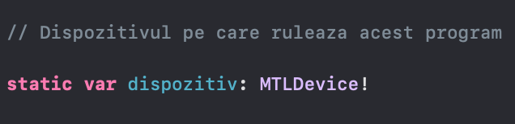

1.  Declar pachetul care o sa fie trimis procesorului video

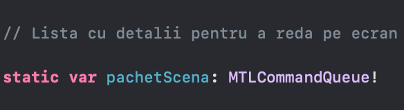

1.  Declar modelul 3d

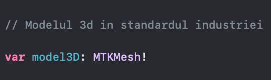

1.  Declar un MTLBuffer pentru a tine minte spațiul în memorie consumat

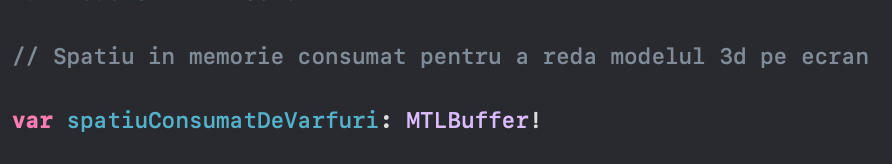

1.  Declar variabila cu detalii pentru a reda modelul

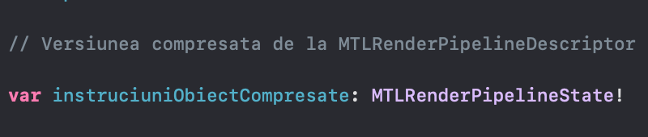

1.  Ultimele doua o sa ajute la mișcarea actorului

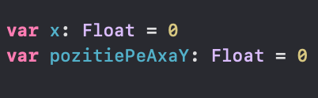

Cum spuneam mai devreme, exista funcții precum MTLRenderPipelineDescriptor(). Cu ajutorul acestuia putem seta indicații tehnice precum:

-   Cu ce funcție de vertex sa randeze obiectul.

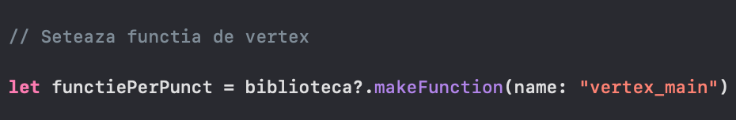

-   Cu ce funcție de fragment sa redea obiectul.

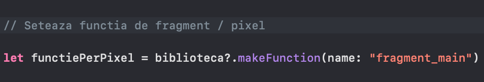

-   Atribuit detalii despre obiect

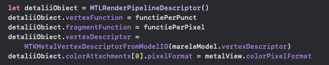

-   Care o sa fie modelul 3d/2d care trebuie colorat

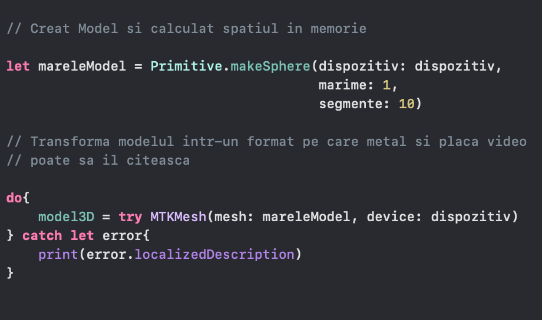

-   Cat spatiu o sa consume în memorie toate vârfurile obiectului (o schimbare de poziție se face folosind parametrii diferiți în funcția de vertex)

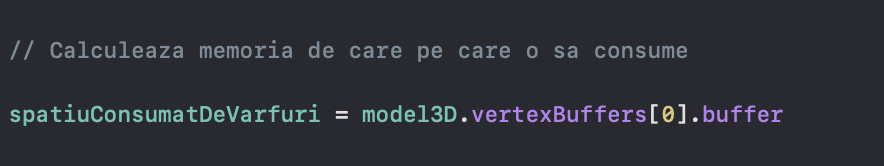

Pentru o comparatie adecvata putem apela la industria restaurantelor. OpenGL este ca un

restaurant. La fiecare comanda de la un client se pregateste mancarea de la zero. Se ia aluatul, se face sub forma de cerc, se pun ingredientele, se gătește la cuptor și în final se servește.

În **Metal**, după ce comanda este plasată, “bucatarul” ia pizza congelată si-o pune la cuptor.

Asta nu înseamnă ca ceea ce scoate **Metal** arată mai prost decat OpenGL, doar că procesul întreg de a pregăti comanda este mai scurt.

Cireașa de pe tort la aceste “descriptors” sta în funcția MTLRenderPipelineState() luand toate caracteristile și impechetandu-le într-un zip special.

**Acțiunile care se vor repeta pană la sfarsitul programului.**

Deși unele lucruri sunt reciclate, tot ramane desenarea efectiva care trebuie apelată.

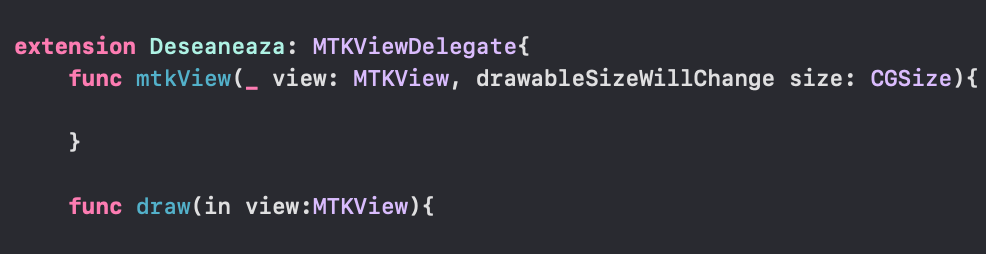

Ca și o problema de logistica buna de a transmite o bucata de mobilă din punctul A în punctul B, trebuie sa începem cu un curier.

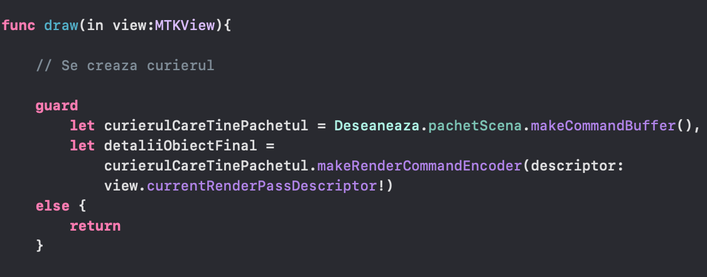

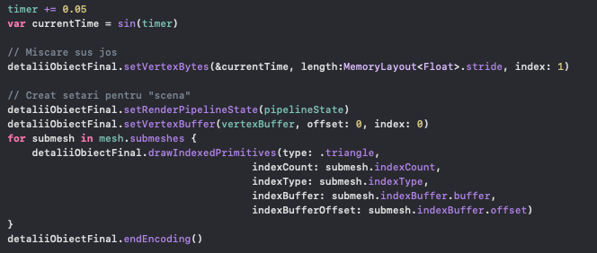

**Modalitatea prin care modelăm actorul**

Totul începe de la ultima, și probabil cea mai plictisitoare, clasa numita Primitive.

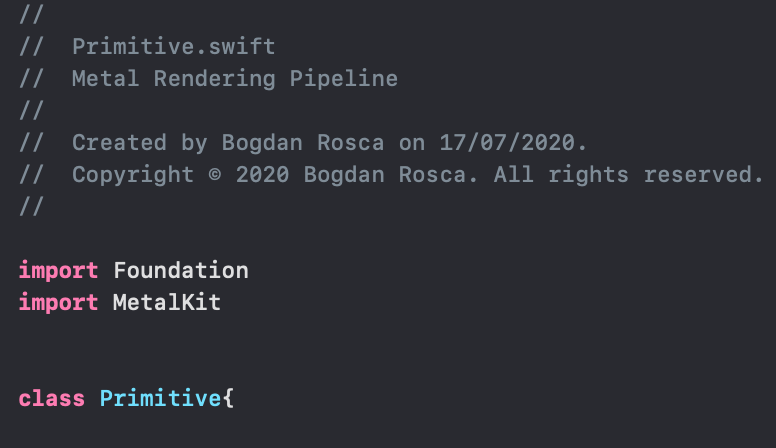

Functile o sa fie statice pentru a putea fi accesate de peste tot, nimic diferit față de C++. Și returneze un MDLMesh deoarece de acest tip de memorie are nevoie **Metal** ca sa functioneze.

O sa fie doua functii care o sa creeze un cub sau o sfera.

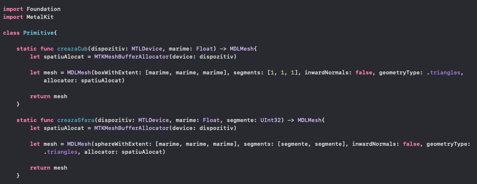

**Rezultatul**

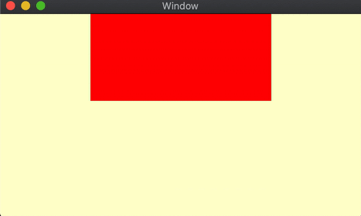

**Concluzie**

În ultimul an am descoperit un lucru foarte important despre inginerie. Aceasta stiinta pare foarte complicata la început, dar devine progresiv devine banală.

În acest moment înțelegem fiecare milimetru care compune acest program. În schimb, în vara 2020, aveam probleme majore intelegand conceptul și scopul funcțiilor.

Pentru o concluzie mai clară, am realizat un program flexibil care poate pune ecran un pătrat sau o sfera și de a îi schimbă poziția. Deasemenea am verificat și ca Xcode, Metal, dar și procesorul grafic, procesorul general și legatura pcie merg cum trebuie.

Trecerea de 3D

Până acum, am setat și am înțeles procedeul de a lua un model 3d și de-al trimite procesorului video pentru a-l reda. Dar, asta nu este treaba unui program care sa redea modele în trei dimensiuni. Pană acum este un program care creeaza un cub sau o sfera pe planul ecranului. Mai tarziu, o sa aiba mai mult sens.

Acum, pe scurt trebuie explicate niște matrici matematice. O sa fie 3 astfel de matrici: matricea modelului, matricea camerei (vedere) și matricea perspectivei (proiecției).

Modul în care un obiect este în acest moment redat funcționează pe baza: Ce vede ecranul, asta vom vedea și noi.

O observatie foarte importanta este faptul ca în loc sa fie redat un cub, sau cel puțin un pătrat, este redat un dreptunghi.

Asta este din cauza ferestrei care poate fi interpretată ca un grafic XoY. În colțul din dreapta sus este punctul A(1,1), iar în colțul din stânga jos este punctul B(-1, -1). Dovada ca pătratul a devenit dreptunghi.

Cand am creat cubul de o unitate lățime, acesta s-a creat cu centrul în mijlocul ecranului. Cam ca în structura de mai jos

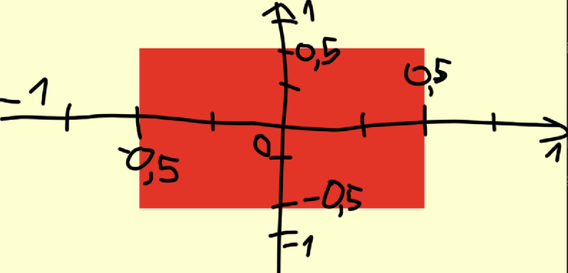

Ignorand talentul inexistent la desen, asta este ceea ce vede fereastra. Un grafic xoy de la -1 la 1 pe ambele axe și totul distorsionat conform marimilor ecranului. Dacă luăm o rigla și o punem pe ecran, putem observa ca o unitate pe ox este mai mare decat o unitate pe oy.

Acum, întrebările mai importante, de ce este nevoie de cele 3 matrici? De ce nu pot sa fie doar 3 float3-uri? De ce poate doar un singur obiect sa fie redat pe ecran?

În ordine descendentă:

1.  Deoarece pana acum doar am testat conceptul de a reda ceva, nu de a fi practic în lumea reala.
2.  Pentru ca exista 3 setari foarte importante care pot fi exstrase din lumea reala: pozitia, rotatia si marimea unui obiect, iar pentru fiecare este nevoie de cel puțin 3 floaturi diferite, așa ca o matrice care poate ține foarte multe informații foarte ușor a fost aleasă.
3.  Ca programul sa fie clasificat cum trebuie, are nevoie sa redea un spațiu tridimensional, cu diferiți actori și perspective.

Fiecare matrice ajuta la traducerea obiectelor:

-   Matricea modelului ajuta la poziționarea obiectului în spațiul tridimensional.
-   Matricea camerei/vederii ajuta la poziționarea vederii noastre în lume. Paradoxal, modul în care acest lucru este posibil nu este prin a muta vederea și a reda ce e în fața ei, ci de a muta TOT ce trebuie redat în funcție de vedere.
-   Matricea perspectivei în final ia tot și îl transforma din spațiu 3d în grafic xoy al ferestrei.

Asimilarea MeritoX cu un teatru real

Teatrul are vechime de aproximativ de 2500 de ani, dar acesta a devenit mult mai popular de la momentul Renașterii. În ziua de azi, teatrul încă este printre noi și nu da vreun semn de dispariție.

Am decis sa structurăm MeritoX ca un teatru.

Totul o sa fie mostenit dintr-o clasa foarte corespunzător numită “Actor”. Fiecare actor o sa aibă toate variabilele și funcțiile necesare de bază.

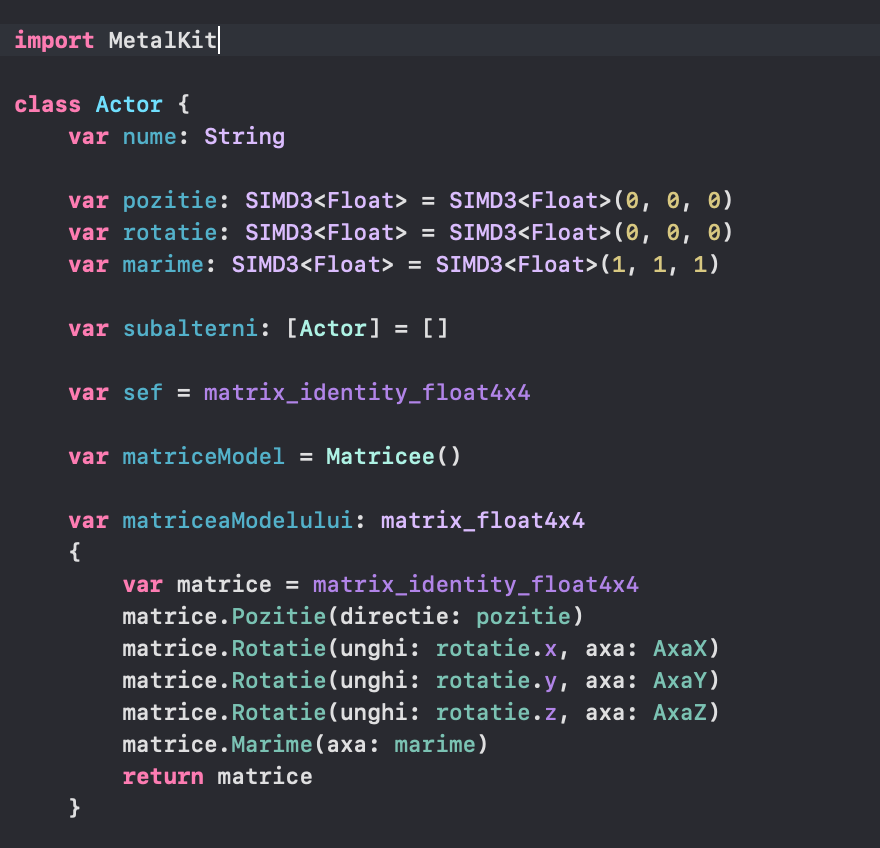

Explicații variabile:

-   Nume: ajută la diferențierea actorilor.
-   Poziție, rotație și mărime: sunt indicatile de plasare în funcție de originea modelului.
-   Subalterni: datorită structurii piramidale este nevoie de subalterni. Un actor poate avea mai mulți subalterni.
-   Șef: un actor poate avea un singur șef în structura piramidala, astfel poziția, mărimea și rotația sunt în funcție de șeful actorului.
-   Cele doua matrici sunt folosite pentru a reda obiectul în spațiu.

Clasele care urmează sa fie mostenite se vor numii:

1.  Personaj - fiecare obiect care urmează sa fie redat pe ecran folosind niste shadere, varfuri și culori.
2.  Cameraman - deși nu tocmai un actor în toata firea, este foarte important ceea ce vedem
3.  Regie - cu rolul de a coordona toți actorii și de a separa foarte ușor un grup de actori, de alt grup de actori.

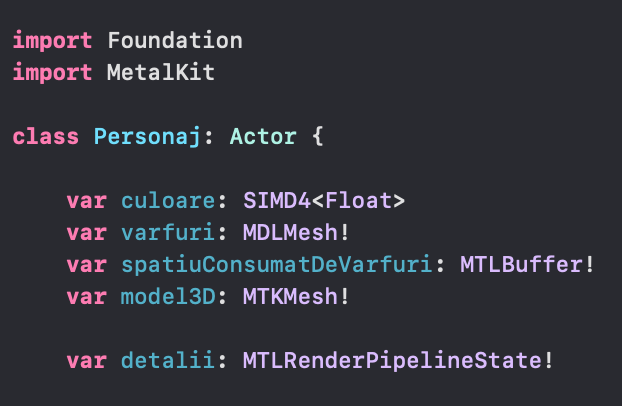

Explicații variabile:

-   Culoare: reprezinta culoarea pe care obiectul o sa o aiba în RGBA
-   Varfuri: modelul înainte să fie formatat pentru Metal
-   SpatiuConsumatDeVarfuri: spațiul consumat în memorie
-   model3D: modelul după ce a fost compresat pentru Metal
-   Detalii: setul de instrucțiuni predefinite la începutul programului pentru redarea obiectului.

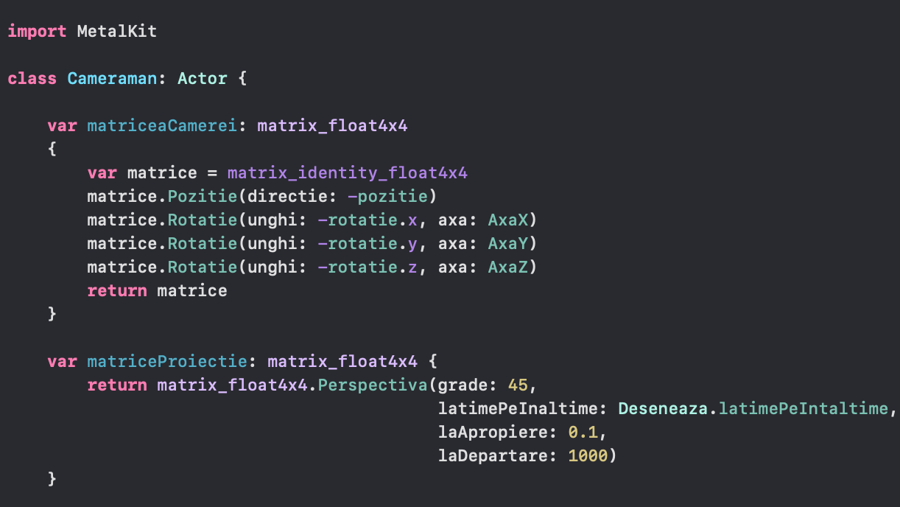

Explicații variabile:

-   matriceaCamerei: matricea de vedere explicata mai sus
-   matriceaProiectie: matricea de perspectiva explicata mai sus

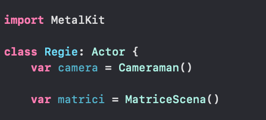

Explicație variabile:

-   Camera: actorul care controlează camera video
-   Matrici: matricile de vedere și proiecție care o sa fie trimise prin shader către procesorul video

Ajutorul matematic

Mai jos este explicația foarte matematica despre schimbarea poziției, invartit pe o axa și mărit în jurul originii.

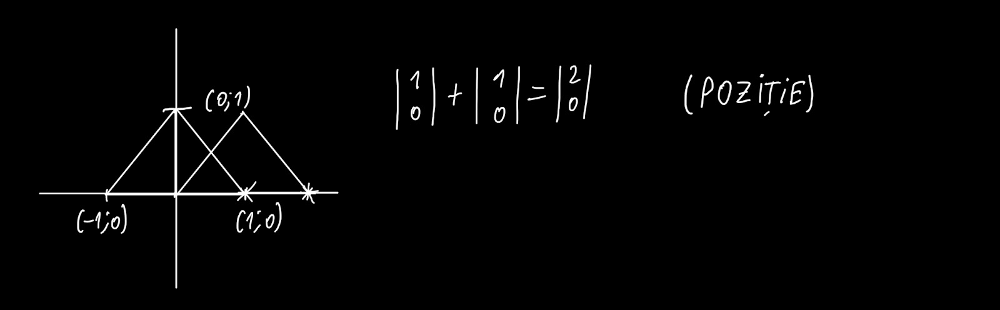

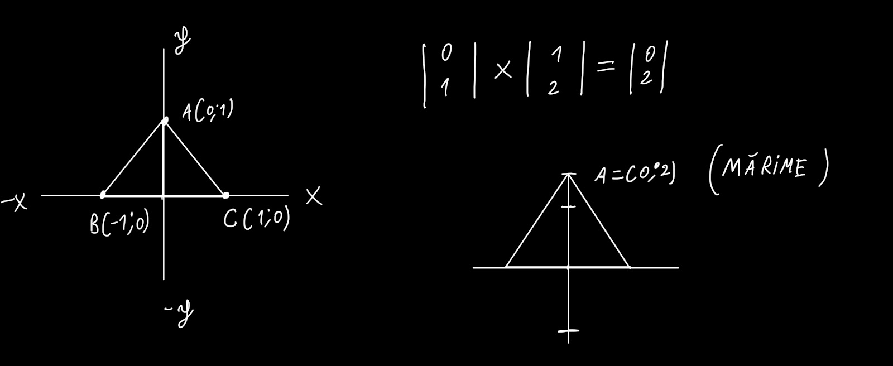

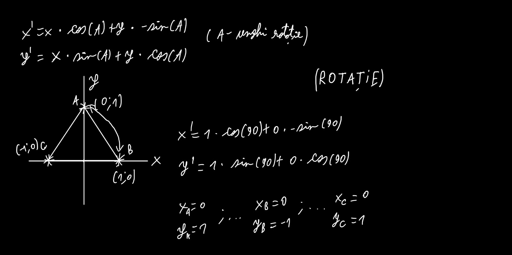

Matricea vederii în schimb, este și mai simpla, mult mai simpla defapt. În realitate, un om se mișca în jurul unui obiect pentru a schimba vederea, dar, paradoxal, în astfel de aplicații, toata lumea se învârte în jurul camerei pentru a schimba vederea.

Aceasta matrice de vedere e foarte simplu de făcut rost. Este exact aceeași ca cea de model mostenita din Actor, dar cu poziție inversată, deoarece așa vrem sa fie pozitionate restul obiectelor.

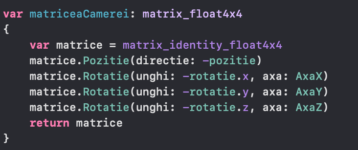

Matricea de perspectiva este probabil cea care are cel mai mare impact în program. Fără ea, este imposibil ca acest program sa fie clasificat în trei dimensiuni. Perspectiva este punctul forte în vederea 3d. Cu ajutorul ei putem sa estimam distanța dintre doua obiecte, sau sa vedem alte unghiuri ale unui corp.

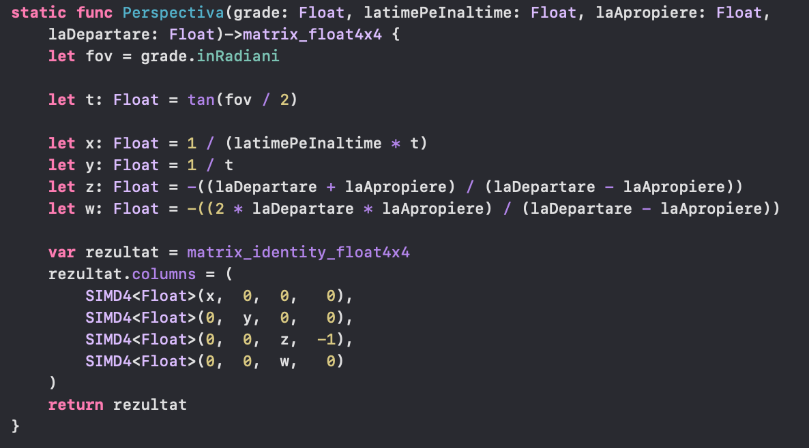

Rescrierea funcțiilor esențiale aplicației

Cand zicem funcții esențiale ne referim la:

1.  Cea care este apelata la inceputul programului o data
2.  Cea care este apelată la fiecare 16.66ms cand ecranul se reimprospataza.

O sa numim aceste funcții o sa fie împărțite în doua:

1.  Una care o sa aibă posibilitatea sa fie rescrisa
2.  Una care să nu fie niciodată modificata

|                          | Inceput Program              | Fiecare cadru nou |
|--------------------------|------------------------------|-------------------|
| Poate sa fie rescrisa    | Porneste()                   | Updateaza()       |
| NU poate sa fie rescrisa | ApelLaInceputulProgramului() | Updt()            |

Am decis sa le diferentiem deoarece fiecare actor o sa aibă nevoie de un set de instrucțiuni logice față de alt actor și pentru a nu încurca ordinea în care aceste operații o sa fie executate, am decis sa le organizăm astfel: Porneste(), ApelLaInceputulProgramului(), Updateaza(), Updt(), și dinnou la Updateaza().

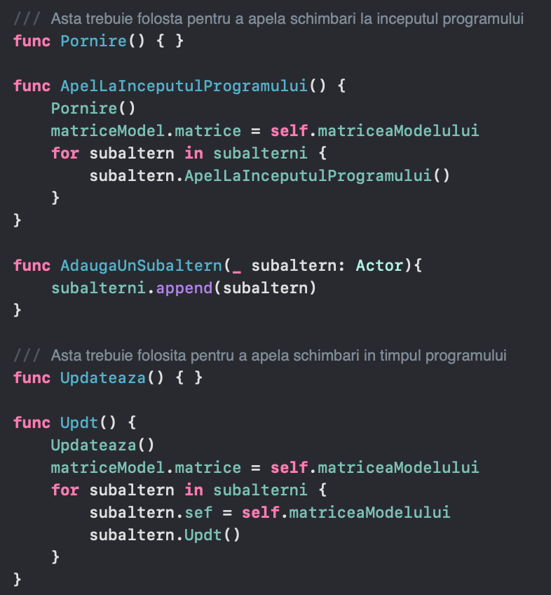

Noile shadere

Deoarece procesorul video face toate calculele legate de poziția vârfurilor, trebuie modificate shaderele originale că sa fie luate în considerare noii parametrii.

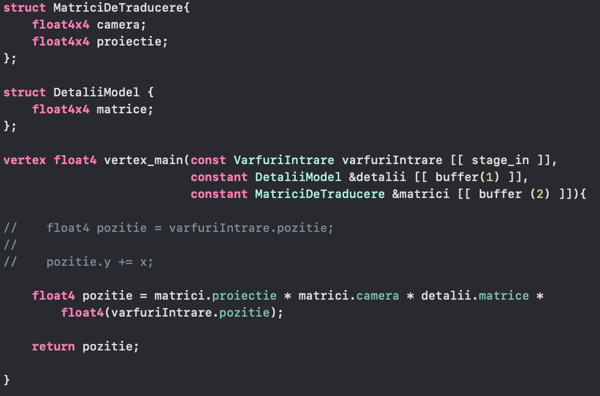

Rescrierea funcțiilor de redare

Am intrebat 100 de romani si au zis ca fiecare se imbraca diferit, cu diferite tipuri de haine și accesorii.

Tocmai din cauza acestei diferențe, redarea nu se calculează în clasa de Actor, ci în Personaje, deoarece fiecare personaj are nevoie de detalii diferite. Dar tot am creat o funcție de a reda în actor pentru ca nu exista niciun motiv practic sa nu fie pe toate clasele care sunt mostenite din actor.

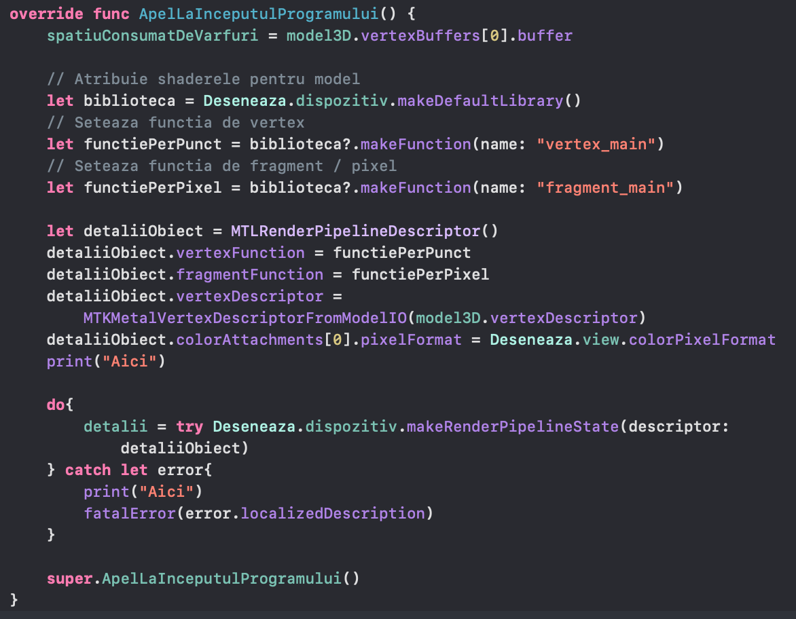

Practic sunt aceleași funcții care erau inainte în init() de la Deseneaza, dar se salveaza detalile separat pentru fiecare actor.

Detalii inițiale sunt aranjate și compresate în ApelLaInceputulProgramului().

Iar funcțiile de redare dinamice se afla în funcția Reda(encoder: MTLRenderCommandEncoder).

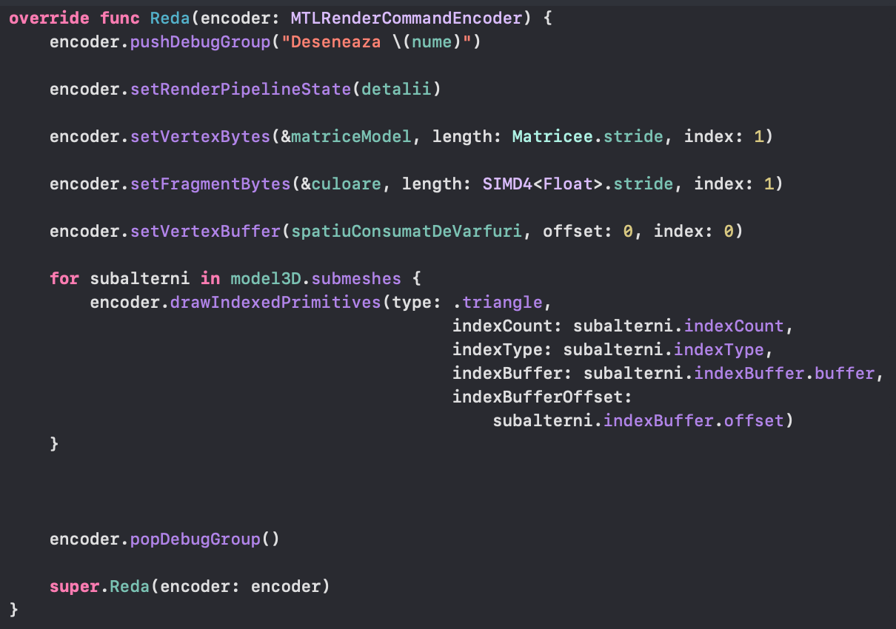

Deasemenea, am mai crea o funcție și mai presus de Updateaza în Regie care se numește “PuneInMiscareRegia(encoder: MTLRenderCommandEncoder)” din doua motive:

1.  Este nevoie de un MTLRenderCommandEncoder pentru a transmite la procesorul video toate informațiile ca înainte.
2.  Ca sa nu aglomerez și sa incurc Updateaza de la regie cu un parametru în plus.

Putem rămâne în Regie deoarece de aici am decis să declarăm matricea de vedere și perspectiva. Ambele create la fiecare cadru nou în Updt() în variabila matrici de tip MatriciScena.

Folosind logica putem deduce că în loc sa specificam la fiecare obiect din scena care sunt cele doua matrici, putem pur și simplu sa le dăm un pachet gata început cu cele doua matrici care mai la urmă sa fie completate și trimis la comanda pentru fiecare obiect.

Redarea dinamica a obiectelor

Pentru ca un obiect sa fie dinamic (adică sa iti schimbe pozitia, rotatia si mărimea), trebuie transmise detalii către shader la fiecare cadru nou.

Acest lucru, ca si MTKPipelineState(), o sa fie creata în clasa Personaj.

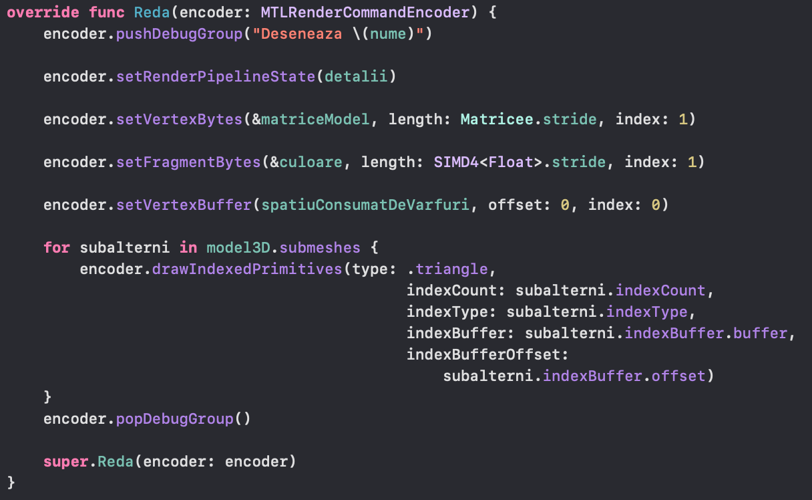

Aceste lucruri sunt foarte asemănătoare cu ce scria în Deseneaza în draw(în view:), dar o cu noile matrici adaugate.

Pus la punct totul în Deseneaza

Avem o mărturisire de făcut, am scris greșit clasa Deseneaza și nu am observat pana acuma niciunul din noi. Din acest moment, toate imaginile o sa fie cu Deseneaza în loc de vechiul, dar și gresitul “Deseaneaza”.

Revenind, în proiectul atașat, am făcut alegerea executiva de a nu șterge prea mult cod în schimb am comentat codul vechi pentru nostalgie.

În init(metalView: MTKView), am comentat de la crearea “mareleModel” pana la crearea “instructiunilorObiectComprimat”.

Am inlocuit cu o variabila nouă numita scena de tip regie și un personaj nou numit actor.

La finalul funcției, înainte de super.init() apelează funcția de ApelLaInceputulProgramului() din scena pentru a putea seta alte atribuții de la alți actori. Am adaugat actorul la scena ca sa poată fi redat și am mutat camera un pic înapoi.

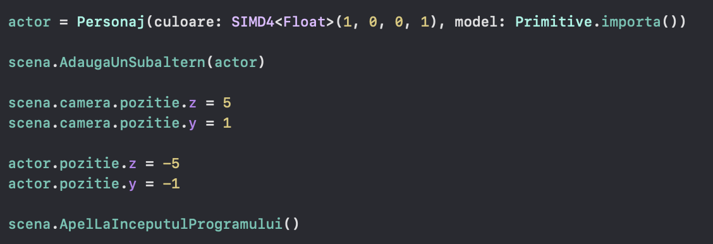

În funcția draw(în view: MTKView) au fost șterse toate referințele al detaliiObiectFinal și au fost inlocuite cu

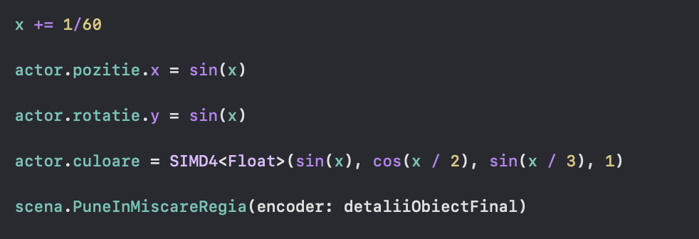

Importarea modelelor deja făcute

Oamenii care fac aceste modele 3d se numesc artiști. Fiecare artist folosește cate un program special pentru a crea astfel de “arta”.

Exista cel puțin 40 de astfel de aplicații gandite pentru artiști. Printre ele se numara: Maya (foarte des folosit de artiști angajați la Walt Disney, DreamWorks sau Pixar) sau Blender (varianta gratuită de la Maya folosită în industrii cu buget redus).

Deoarece sunt așa de multe aplicații care fac același lucru exista și un standard pentru aceste modele 3d, defapt exista mai multe standarde și extensii de fișiere. Unul dintre ele este formatul “OBJ” care este prescurtat de la “object” care înseamnă “obiect”.

În clasa Primite create mai devreme am adaugat o funcție care preia aceste modele și le importa în program de către regie.

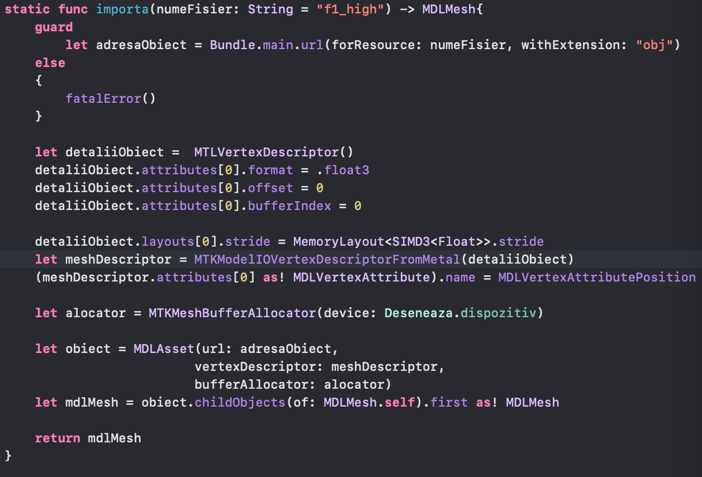

Concluzie

Aici avem un program foarte simplu și explicat care importă un număr nelimitat de modele 3d și le reda pe ecran folosind o modalitate care le permite sa fie repozitionate, rotite și marite/micsorate.

Acest program nu o sa fie folosit vreodată în lumea reala pentru a produce vreun ban sau a satisface o persoana în afară de noi doi.

Scopul nu a fost pentru a produce ceva practic pentru cineva. Scopul a fost de a avea un loc de joacă pentru a înțelege mai multe lucruri:

1.  Cum funcționează o librărie grafica? - Metal
2.  Cum funcționează shaderele? - De vârf și de fragment/pixel
3.  Matricile aplicate - matricile de model, vedere si perspectiva
4.  Importarea fișierelor exterioare în program.
5.  Setarea unui algoritm flexibil de utilizare a programului - actor/regie/personaje

Bibliografia

1.  **Metal** by Tutorial de raywenderlich Tutorial Team - Caroline Begbie si Marius Horga
2.  **Metal** Programming Guide de Janie Clayton
3.  Unity Technologies - <https://learn.unity.com/>
4.  3D Game Programming with DirectX 12 de Frank D Luna
5.  2etime - Rick Twohy - <https://www.youtube.com/user/Twohyjr>
6.  Wikipedia - Shadere / Shaders
7.  Linus Tech Tips - Luke Lafreniere / Linus Sebastian / Anthony Young / Alex Clark - <https://www.youtube.com/user/LinusTechTips>
8.  Wallstreet Journal
9.  The Cherno - <https://www.youtube.com/user/TheChernoProject>
10. Computerphile - John Chapman - The True Power Of the Matrix - <https://www.youtube.com/watch?v=vQ60rFwh2ig>
11. GDC - <https://www.gdcvault.com/>
